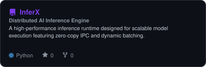
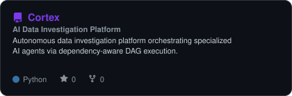
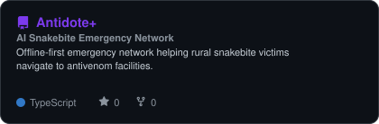
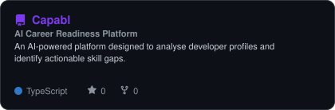
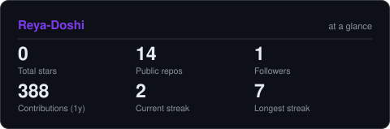
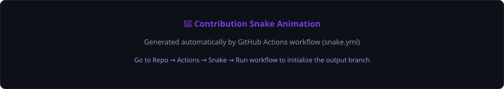

<table width="100%" style="border-collapse: collapse; border: none;">
  <tr>
    <td width="35%" align="center" valign="middle" style="border: none; padding: 15px;">
      <!-- ID CARD PORTRAIT SCANNER -->
      <picture>
        <source media="(prefers-color-scheme: dark)" srcset="assets/portrait-dark.svg">
        <source media="(prefers-color-scheme: light)" srcset="assets/portrait-light.svg">
        
      </picture>
    </td>
    <td width="65%" align="left" valign="middle" style="border: none; padding: 15px;">
      <!-- ID CARD DETAILS -->
      <h1 style="margin: 0; padding: 0; font-size: 32px; letter-spacing: -0.5px;">🪪 REYA DOSHI</h1>
      

        Software Engineer in the Making · AI · Backend · Systems
      

      

        
      

      

        📍 <strong>Location:</strong> Hyderabad, India 🇮🇳 &nbsp;|&nbsp; 🎓 <strong>Status:</strong> 3rd-Year IT Student 
        ⚙️ <strong>Engineering Creed:</strong> <em>Build → Break → Learn → Repeat</em>
      

      

        
        
        
        
      

    </td>
  </tr>
</table>

---

### 📌 About Me

I am a 3rd-year Information Technology student interested in building intelligent, scalable, and reliable software systems.

- 🎯 **Core Focus:** Artificial Intelligence · Backend Engineering · Distributed Systems · Cloud & Infrastructure · Data Structures & Algorithms
- 🧠 **Foundations:** Java · DSA · OOP · DBMS · Distributed Systems

---

### ⚡ Currently Doing

> 🚀 **Currently building AI and systems-focused projects.**

---

### 🚀 Featured Projects

<table width="100%">
  <tr>
    <td width="50%" align="center">
      <a href="https://github.com/Reya-Doshi/InferX">
        <picture>
          <source media="(prefers-color-scheme: dark)" srcset="assets/card-InferX-dark.svg">
          <source media="(prefers-color-scheme: light)" srcset="assets/card-InferX-light.svg">
          
        </picture>
      </a>
    </td>
    <td width="50%" align="center">
      <a href="https://github.com/Reya-Doshi/Cortex">
        <picture>
          <source media="(prefers-color-scheme: dark)" srcset="assets/card-Cortex-dark.svg">
          <source media="(prefers-color-scheme: light)" srcset="assets/card-Cortex-light.svg">
          
        </picture>
      </a>
    </td>
  </tr>
  <tr>
    <td width="50%" align="center">
      <a href="https://github.com/Reya-Doshi/AntidotePlus">
        <picture>
          <source media="(prefers-color-scheme: dark)" srcset="assets/card-AntidotePlus-dark.svg">
          <source media="(prefers-color-scheme: light)" srcset="assets/card-AntidotePlus-light.svg">
          
        </picture>
      </a>
    </td>
    <td width="50%" align="center">
      <a href="https://github.com/Reya-Doshi/Capabl">
        <picture>
          <source media="(prefers-color-scheme: dark)" srcset="assets/card-Capabl-dark.svg">
          <source media="(prefers-color-scheme: light)" srcset="assets/card-Capabl-light.svg">
          
        </picture>
      </a>
    </td>
  </tr>
</table>

#### Project Highlights

* **[InferX](https://github.com/Reya-Doshi/InferX)** — *Distributed AI Inference Engine*
  * High-performance inference runtime designed for scalable model execution.
  * Features zero-copy SharedMemory IPC, multi-process worker architecture, and dynamic batching.
  * **Tech:** `Python` · `Shared Memory` · `IPC` · `Concurrency` · `AI`

* **[Cortex](https://github.com/Reya-Doshi/Cortex)** — *AI Data Investigation Platform*
  * Autonomous data investigation platform orchestrating specialized AI agents and analytical workflows.
  * Features dependency-aware DAG execution, concurrent processing via ThreadPoolExecutor, and Pandas analysis.
  * **Tech:** `Python` · `AI Agents` · `Pandas` · `Concurrency` · `Pytest`

* **[Antidote+](https://github.com/Reya-Doshi/AntidotePlus)** — *AI Snakebite Emergency Network*
  * Offline-first emergency network helping rural snakebite victims reach facilities with available antivenom.
  * Features offline-first architecture, AI species identification, Leaflet + OSRM routing, and multilingual support.
  * **Tech:** `AI` · `Leaflet` · `OSRM` · `Routing` · `Offline-first`

* **[Capabl](https://github.com/Reya-Doshi/Capabl)** — *AI Career Readiness Platform*
  * **Global Finalist — USAII Global AI Hackathon 2026**
  * AI-powered platform for developer profile analysis and actionable skill-gap identification.
  * **Tech:** `React` · `Node.js` · `PostgreSQL` · `Prisma` · `Google Gemini`

---

### 🏆 Achievements

- 🏅 **Global AI Hackathon Finalist** — *United States Artificial Intelligence Institute (USAII) Global AI Hackathon 2026*
  - Reached the Global Final Round with **Capabl**.
- 🎓 **Google Student Ambassador (2026)**
  - Selected as a Google Student Ambassador; participating in AI and student community workshops.
- 📱 **OnePlus Student Ambassador (2026)**
  - Active member of the OnePlus student community creating technical content and representing campus initiatives.
- ⚡ **Technical Focus**
  - Building AI, backend engineering, systems, and distributed solutions.

---

### 🛠️ Tech Stack

#### Systems & Core Languages

#### Backend & Infrastructure

#### Frontend & Mobile

#### Cloud & Developer Tools

#### AI / Data

---

### 💻 Core CS Foundations

- ☕ **Java & Core Concepts:** OOP · Collections · Exception Handling · Generics
- 🗄️ **DBMS & Storage:** SQL · Normalization · Transactions · Indexing
- 🖥️ **Computer Science:** Data Structures & Algorithms · Operating Systems · Networks · Distributed Systems

---

### 📊 Skill & Language Radars

  <picture>
    <source media="(prefers-color-scheme: dark)" srcset="assets/radar-dark.svg">
    <source media="(prefers-color-scheme: light)" srcset="assets/radar-light.svg">
    
  </picture>
  &nbsp;
  <picture>
    <source media="(prefers-color-scheme: dark)" srcset="assets/radar-langs-dark.svg">
    <source media="(prefers-color-scheme: light)" srcset="assets/radar-langs-light.svg">
    
  </picture>

---

### 📈 GitHub Stats

  <picture>
    <source media="(prefers-color-scheme: dark)" srcset="assets/card-stats-dark.svg">
    <source media="(prefers-color-scheme: light)" srcset="assets/card-stats-light.svg">
    
  </picture>

---

### 🐍 Contribution Activity

  <picture>
    <source media="(prefers-color-scheme: dark)" srcset="https://raw.githubusercontent.com/Reya-Doshi/Reya-Doshi/output/snake-dark.svg">
    <source media="(prefers-color-scheme: light)" srcset="https://raw.githubusercontent.com/Reya-Doshi/Reya-Doshi/output/snake.svg">
    
  </picture>

---

### 🌱 Beyond the Code

Exploring AI tools, participating in tech communities, creating technical content, and debugging code that was working five minutes ago.

---

  Crafted with 💜 by <a href="https://github.com/Reya-Doshi">Reya Doshi</a>

